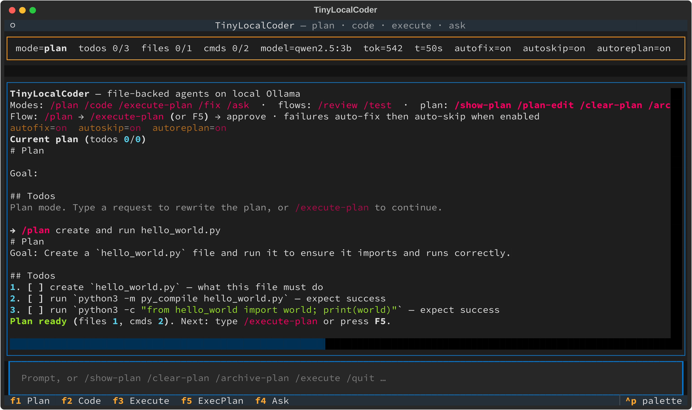
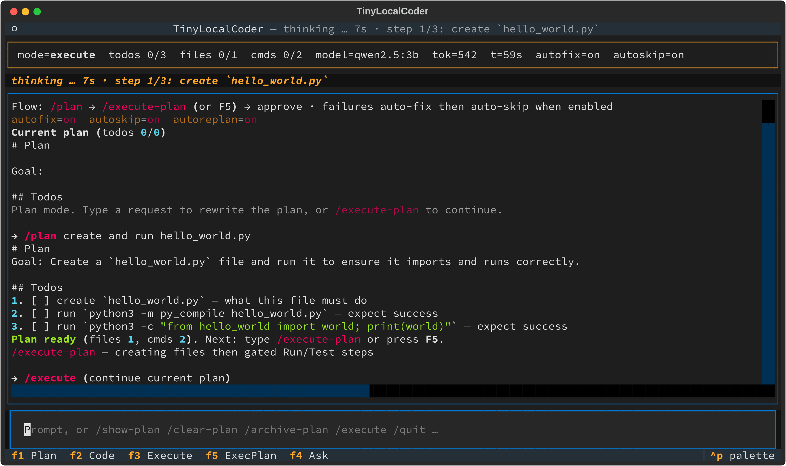
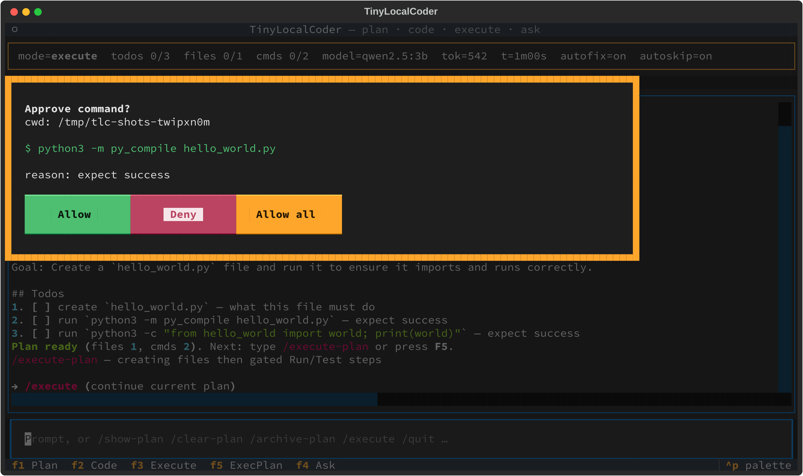
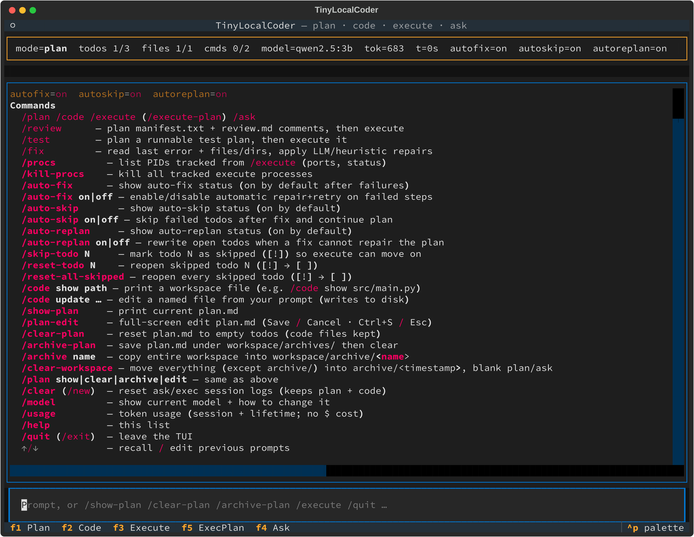

# 🩷🤖 TLC — Tiny Local Coder

**A coding agent that runs entirely on your machine.** No GPU, no API key, nothing leaves the box. TLC makes a 3B model with a 2048-token context behave like a competent coding agent by keeping its memory on disk and only ever showing it one step at a time.



## Why TLC

- 🩷🤖 **Runs on a memory-compromised host.** Qwen2.5 3B via Ollama on CPU, ~12 GB RAM. No GPU required.
- 🩷🤖 **Disk is the model's memory.** The plan, the code, the command log and the Q&A transcript all live in `workspace/`, so each LLM call sees only `Goal` plus the active todo — never the whole plan.
- 🩷🤖 **Nothing runs without your approval.** Every shell command stops at a gate: Allow / Deny / Allow all.
- 🩷🤖 **Deterministic Python does the structural work.** Plan validation, inventory, review and path-fixing are plain code. A 3B model is never trusted to manage plan structure.

## Requirements

- Docker + Docker Compose (on a Mac: `./colima-start-stop-on-mac.sh`)
- ~12 GB RAM for the Docker VM (CPU-only is fine). Default Colima is 2 GB — too small for `qwen3.5:4b`.
- No GPU

## Quick start

```bash
cp .env.example .env   # once
./start-service.sh              # prompts each time; Return keeps the saved default
./start-service.sh --model qwen3.5
./start-service.sh --no-prompt  # skip the picker (scripts / CI)
./stop-service.sh               # stop the suite (use this instead of bare docker compose down)
```

The API listens on `http://localhost:8000`. Launch the interactive TUI with:

```bash
./cli.sh
# equivalent: docker compose run --rm -it app tui
```

`./start-service.sh` checks whether the selected model is installed and pulls it if needed (`qwen2.5` → [`qwen2.5:3b`](https://ollama.com/library/qwen2.5:3b), `qwen3.5` → [`qwen3.5:4b`](https://ollama.com/library/qwen3.5:4b)). The first pull is slow; weights stay in `crew_pipeline_ollama_data` across `./stop-service.sh`.

## How-to: your first plan

**1. Enter plan mode and describe the job.** Type `/plan`, then your request:

```text
/plan
create and run hello_world.py
```

TLC writes `workspace/plan.md` as a short numbered todo list — a few `create` steps, then one batched `py_compile`, then one short smoke check. Inspect or hand-edit it any time with `/show-plan` and `/plan-edit`.

**2. Execute it.** Type `/execute-plan` (or press **F5**). TLC walks the todos one at a time, writing files and then verifying them:



**3. Approve the shell command.** When a todo needs to run something, everything stops and waits for you:



Choose **Allow** for this one command, **Deny** to skip and log it, or **Allow all** to auto-approve for the rest of the session.

**4. When something fails**, TLC tries to recover on its own: one code repair and retry, then — if the *todo itself* looks wrong — one rewrite of the remaining open todos, and failing that it marks the step `[!]` and moves on. Reopen skipped steps with `/reset-todo N` and run `/execute-plan` again.

Full walkthroughs for fixing, reviewing and testing are in **[docs/use-cases.md](docs/use-cases.md)**.

## Modes

| Mode | Role |
|------|------|
| `/plan` | Build `workspace/plan.md` as a **numbered todo list** (Goal + `1. [ ] create …` / `run …`) |
| `/code` | Run the next create/refine todo only (small context) |
| `/execute-plan` | Walk todos one-by-one; each LLM call sees **only the current step** |
| `/ask` | Q&A written to `workspace/ask.md` |
| `/fix` | Code-only repair of the last failure |
| `/review` | Tool-built `manifest.txt` + opinionated `review.md`, then `/execute-plan` |
| `/test` | Plan a runnable test plan into `plan.md`, then run `/execute-plan` |

**Default plan shape (enforced after `/plan`):** a few `create`/`refine` steps → **one** batched `py_compile` → **one** short `python3 -c` smoke check. Prefer ≤8 todos. Meta commands (`reset-todo`, …) are stripped if they leak into the plan.

After `/plan` finishes, the TUI prints a next-step hint. While agents work, a **thinking …** line shows elapsed time and clears when the reply arrives.

## Session commands



| Command | Role |
|---------|------|
| `/quit` (`/exit`) | Leave the TUI |
| `/show-plan` (`/plan` or `/plan show`) | Print current `plan.md` |
| `/plan-edit` (`/edit-plan`, `/plan edit`) | Full-screen edit of `plan.md` (Save / Cancel) |
| `/clear-plan` (`/plan clear`) | Reset `plan.md` to empty Goal/Todos (keeps code files) |
| `/archive-plan` (`/plan archive`) | Save `plan.md` under `workspace/archives/` then clear |
| `/clear` (`/new`) | Reset ask/exec session logs; keeps plan + code; resets session token counter |
| `/model` | Show current model and how to change it in `config.toml` |
| `/usage` | Session + lifetime token counts (no $ cost) |
| `/auto-fix on\|off` | Enable/disable automatic repair+retry on failed steps |
| `/auto-skip on\|off` | Skip failed todos after fix and continue plan |
| `/auto-replan on\|off` | Rewrite open todos when a fix cannot repair a bad plan step |
| `/skip-todo N` | Mark todo N as skipped (`[!]`) so execute can move on |
| `/reset-todo N` | Reopen skipped todo N (`[!]` → `[ ]`) |
| `/reset-all-skipped` | Reopen every skipped todo |
| `/code show PATH` | Print a workspace file |
| `/code update …` | Edit a named file from your prompt (writes to disk) |
| `/archive NAME` | Copy the entire workspace into `workspace/archive/<name>` |
| `/clear-workspace` | Move everything (except `archive/`) into `archive/<timestamp>`, blank plan + ask |
| `/procs` | List PIDs tracked from `/execute` (ports, status) |
| `/kill-procs` | Kill all tracked execute processes |
| `↑` / `↓` | Recall and edit previous prompts |
| `/help` | List commands |

## How it works

Everything runs through a single compiled LangGraph `StateGraph`. Entry is always `route`, and the requested mode selects the path: `plan`, `code`, `execute_step`, `fix`, `replan`, `ask`, `critic`. Nodes don't pass state to each other in messages — they pass it through **files on disk**.

The recovery ladder during `/execute-plan`:

```text
run todo fails
  └─ junk command?      → skip immediately
  └─ auto-fix           → one code patch, retry the same todo
       └─ plan smell?   → auto-replan, rewrite the remaining open todos once
       └─ otherwise     → auto-skip, mark [!] and continue
```

Design rationale and the small-model constraints that drive it: **[docs/Architecture.md](docs/Architecture.md)**. Node-by-node graph wiring and diagrams: **[docs/orchestration.md](docs/orchestration.md)**.

## File memory

Because context is small (`NUM_CTX=2048`), agents use disk as long-term memory:

- `workspace/plan.md` — plan + checkboxes
- `workspace/prototypes/` — generated code
- `workspace/ask.md` — ask transcript
- `workspace/exec.log` — gated command results
- `workspace/.index/` — chunk indexes for retrieval

## Gated execution

No shell command runs without approval:

- **Allow** — this command once
- **Deny** — skip and log
- **Allow all** — auto-approve for the rest of the session

API flow:

- `POST /v1/execute` may return `pending_approval`
- `POST /v1/execute/approve` with `{ "command_id", "decision": "allow"|"deny"|"allow_all" }`

## Thinking critic

An end-of-graph node asks once whether the task is complete. Disable with:

```bash
THINKING_ENABLED=false
```

## Configuration

`./start-service.sh` asks for the model every time. The saved default is pre-selected — press Return to keep it, or pick another. The choice is written to `config.toml`.

```toml
model = "qwen2.5"   # or "qwen3.5"
```

```bash
./start-service.sh --model qwen3.5
./start-service.sh --no-prompt
```

| Key | Pulls | Size | Source |
|-----|--------|------|--------|
| `qwen2.5` | `qwen2.5:3b` | ~2 GB | https://ollama.com/library/qwen2.5:3b |
| `qwen3.5` | `qwen3.5:4b` | ~3.4 GB | https://ollama.com/library/qwen3.5:4b |

See `.env.example` for the other knobs:

- `NUM_CTX=2048` (raise to 4096 only if you have headroom)
- `AUTO_FIX` / `AUTO_FIX_MAX` — one code repair+retry per failed run step
- `AUTO_REPLAN` — one open-todo rewrite when the failing step looks like a bad plan
- `AUTO_SKIP` — mark failed steps `[!]` and continue
- `WORKSPACE_DIR=/workspace`
- `EXEC_TIMEOUT_SEC=60`

## API

- `GET /health`
- `POST /v1/plan` `{ "prompt": "..." }`
- `POST /v1/code` `{ "prompt": "..." }`
- `POST /v1/execute` `{ "prompt": "..." }`
- `POST /v1/execute/approve` `{ "command_id": "...", "decision": "allow" }`
- `POST /v1/ask` `{ "prompt": "..." }`
- `POST /v1/review` `{ "prompt": "..." }` — plan then execute review workflow
- `POST /v1/test` `{ "prompt": "..." }` — plan then execute test workflow
- `GET /v1/workspace/files`
- `GET /v1/workspace/file?path=plan.md`

## Screenshots

The images above are real captures of the TUI driven against a real local model. Regenerate them with:

```bash
docker compose up -d ollama
PYTHONPATH=src python3 scripts/make_screenshots.py --out docs/img
for f in docs/img/*.svg; do magick -background none -density 200 "$f" "${f%.svg}.png"; done
```

## License

MIT — see [LICENSE](LICENSE).
