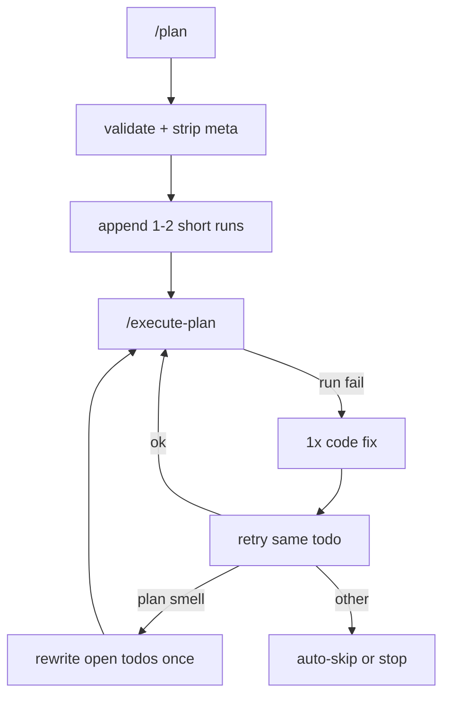
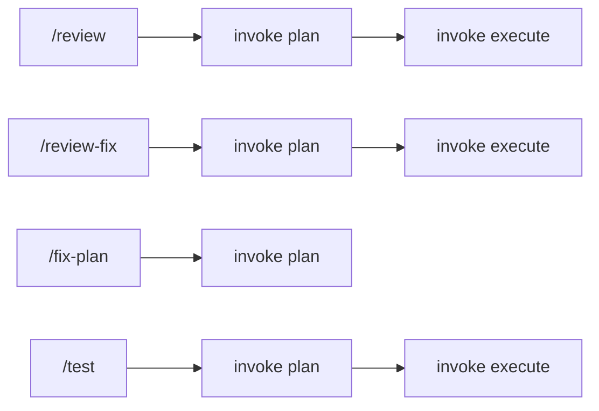

# TinyLocalCoder Architecture

File-backed LangGraph agents for **small local models** (e.g. qwen2.5:3b, `NUM_CTX=32768`). Disk is long-term memory; the LLM usually sees **one step at a time**.

Hands-on CLI walks for common jobs: [`use-cases.md`](use-cases.md).  
LangGraph agent wiring and diagrams: [`orchestration.md`](orchestration.md).

## Constraint (non-negotiable)

Every design choice favors:

- **Few, short todos** — one tiny action each; prefer ≤8–10 total steps for a feature
- **Deterministic glue over more LLM calls** — validate / augment / classify / **replan path-fix** in Python; LLM only when it must rewrite a tiny scrap of text
- **Tools pick up the heavy lifting** — dedupe, `path/to/` strip, caps, Done narrative; never trust a 3B to manage plan structure
- **Minimal prompts** — fix/replan see failure + file *names* + open todo lines, not whole trees or big dumps
- **Short verify commands** — a build check plus one behavioral run (`py_compile` + `python3 -c`, `make` + `./binary`); never long-running servers in todos
- **Languages live in a table, not in prompts** — [`toolchains.py`](../src/tinylocalcoder/toolchains.py) owns every extension, run prefix, compile/smoke command, diagnostic regex and apt package; no other module names a language

“More rigorous” means **harder to skip a check**, not **longer plans**.

## High-level flow



## Modes and workflows

### Core modes (single pipeline invoke)

| Mode | Role |
|------|------|
| `/plan` | Rewrite `workspace/plan.md` (Goal + numbered todos) |
| `/code` | Next create/refine todo only (or freeform show/update a file) |
| `/execute-plan` | Walk todos one-by-one (create → run/test with gated shell) |
| `/fix` | Code-only repair of last failure (no auto-replan) |
| `/ask` | Q&A → `workspace/ask.md` |

Orchestration lives in [`src/tinylocalcoder/graph/builder.py`](../src/tinylocalcoder/graph/builder.py).

### Compound workflows (plan → execute)

[`agents/workflows.py`](../src/tinylocalcoder/agents/workflows.py) chains the **existing** `/plan` then `/execute-plan` with a fixed prompt. No new LangGraph nodes or modes — the user is spared typing the two steps. The TUI streams `review » N/4` and `review-fix » N/3` so the current stage is visible.



| Workflow | Fixed plan intent | Then |
|----------|-------------------|------|
| `/review` | Tool writes `manifest.txt` first, `/plan` from that list, tool writes per-file `review.md` | `/execute-plan` |
| `/review-fix` | Parse `review.md` findings, `/plan` refine/fix todos (skip execute if none) | `/execute-plan` |
| `/fix-plan` | Compare requirement vs `plan.md` + workspace gaps, rewrite todos | *(stop — user runs `/execute-plan`)* |
| `/test` | Invent a **runnable test plan** as `plan.md` (find/run tests, or add a tiny smoke test) | `/execute-plan` |

Optional trailing text is appended to the fixed prompt (`/review focus on src/`, `/review-fix only high`, `/fix-plan start_service.sh`, `/test only unit`).

API mirrors: `POST /v1/review`, `POST /v1/review-fix`, `POST /v1/fix-plan`, `POST /v1/test`.

### Recovery and plan hygiene (during execute)

| Mechanism | Role |
|-----------|------|
| Auto-fix | One code repair + retry on a failed run todo |
| Auto-replan | One open-todo rewrite when the failing step smells like a bad plan |
| Auto-skip | Mark failed step `[!]` and continue |
| `/skip-todo N` / `/reset-todo N` | Manual skip / reopen one todo |
| `/reset-all-skipped` | Reopen every `[!]` todo |

TUI toggles: `/auto-fix`, `/auto-skip`, `/auto-replan`.

## Components

| Path | Role |
|------|------|
| `agents/thinking.py` | Plan agent (`PLAN_SYSTEM`) |
| `agents/workflows.py` | `/review` + `/review-fix` + `/fix-plan` + `/test` prompts; `run_workflow` |
| `tools/manifest.py` | Deterministic `manifest.txt` inventory for `/review` (skips archive/.index/meta) |
| `tools/review.py` | Deterministic `review.md` + parse findings for `/review-fix` |
| `memory/files.py` | Todo parse, `finalize_plan`, meta strip, validate/augment |
| `agents/coding.py` | Create/refine one file per step |
| `agents/execution.py` | Run todos + `expect …` checks |
| `agents/fixing.py` | Heuristics + LLM CREATE/WRITE; `NEEDS_REPLAN`; plan-smell classify |
| `agents/replan.py` | Tiny-context rewrite of remaining todos |
| `agents/critic.py` | End-of-pass CONTINUE/DONE (mostly deterministic by mode) |
| `tui/app.py` | Modes, workflows, meta commands |
| `toolchains.py` | Language registry: extensions, run prefixes, compile/smoke builders, diagnostics, apt packages |
| `tools/provision.py` | Detect a missing toolchain, install it through the gate, record it for the next image build |
| `config.py` | `AUTO_FIX`, `AUTO_FIX_MAX`, `AUTO_SKIP`, `AUTO_REPLAN`, `AUTO_INSTALL` |

Workspace memory: `plan.md`, prototypes, `exec.log`, `ask.md`, `session.md`, `manifest.txt` / `review.md` (from `/review`; `/review-fix` reads the latter), `.index/`.

## Test-by-default plans

After `/plan`, [`finalize_plan()`](../src/tinylocalcoder/memory/files.py) always:

1. Normalizes Goal + `## Todos`
2. **Strips meta-like todos** (`reset-todo`, `skip-todo`, `review`, `review-fix`, `fix-plan`, `test`, `reset_todo_*.py`, …)
3. **Drops junk run targets** — anything whose first token is not a registered tool (`python3`, `pytest`, `make`, `g++`, `cargo`, `apt-get`, `./…`, `PYTHONPATH=…`), e.g. bare `Define`
4. **Rewrites bad FastAPI verifies**: `from db import db; db.selectall()` → one short `from db import app; … routes …` check
5. **Caps runs**: at most one open provision, one open compile and one open behavioral run, in that order
6. **Augments** if still missing compile/smoke, using the registry's builders for whatever language the creates are in — `make` or `g++ -Wall -std=c++17 -o …` then `./binary` for C++, `py_compile` then `python3 -c "import …"` for Python
7. **Prepends an install step** when a needed toolchain's probe binary is absent (`apt-get install -y g++ make`)

`PLAN_SYSTEM` steers the same shape. Its example block is chosen per language
from the registry and *swapped in*, not added to — at 2048 ctx there is no room
for a menu of languages, and the Python-only rules (`PYTHONPATH`,
`src/__init__.py`, the twin-object warning) are dropped for non-Python targets.

Good archive example: [`workspace/archive/beer-api/plan.md`](../workspace/archive/beer-api/plan.md).

## Meta-command hygiene

- TUI meta commands need a leading `/`. Bare input like `reset-todo 8` is treated as meta and **not** sent to the plan agent.
- Words that are also freeform English (`plan`, `review`, `review-fix`, `test`, …) only act as commands when prefixed with `/`.
- Plan normalize / `is_meta_todo_target` drops leaked meta lines and follow-on `reset_todo_*.py` invents.

## Plan-aware recovery

Tiny-model rule: **tools do structural work**; the LLM only gets tightly framed text jobs.

On a failed run step during `/execute-plan`:

0. **Classify** the failure (`classify_failure`): *junk* (prose, not a command) / *environment* (a registered build tool is absent) / *code*
1. **Junk command** → skip immediately (no LLM fix, **does not** consume replan budget)
1b. **Environment** → `apt-get` the toolchain through the approval gate and retry the step (`AUTO_INSTALL=true`). A missing `./binary` is deliberately *not* an environment failure — it means the build never produced it
2. **Auto-fix once** (`AUTO_FIX_MAX=1`) — heuristics + optional CREATE/WRITE, then retry
3. If still failing and **plan smell** → **auto-replan once** (`AUTO_REPLAN=true`):
   - Collapse completed work into a one-line `Done:` narrative (not numbered `[x]` spam)
   - **Deterministic tools first**: path/import mismatch (`No module named X` + `**/X.py` exists) rewrites the open verify without an LLM
   - **LLM last resort**: return 1–2 open todo lines only; Python assembles Goal + Done + Todos
   - Discard spam / huge model output; fall back to a short verify for whatever language the workspace contains
4. Otherwise **auto-skip** (`[!]`), and **skip clone runs** with the same `from X import Y` prefix

`finalize_plan` always **dedupes**, strips `path/to/` placeholders, and **hard-caps** todo count so a looping 3B cannot poison `plan.md`.

Manual `/fix` does not auto-replan; it may hint to re-run execute with auto-replan on.

## Fix guardrails

- Heuristic `__init__.py` only for packages named in the failing import — not a blanket `src/`
- Heuristic Makefile repair: a `missing separator` diagnostic re-indents recipe lines with a TAB, no model call
- Fix prompt includes **one** failed todo line, a compact `file:line — message` diagnostics block, a one-line language hint, the workspace file name list and small snippets
- Build diagnostics (gcc/clang, make, ld, rustc, go, …) are parsed by the registry, so a `.cpp` or `Makefile` failure names a file the fix agent can actually open. `stderr` precedes `stdout` in the failure blob because only its first 2500 chars reach the prompt
- `NEEDS_REPLAN` → no file writes; graph takes the replan path
- A synthesized `./binary` verify carries no arguments — nothing deterministic knows what the program expects. When one fails with no compiler diagnostics it is treated as **plan smell**, so replan rewrites the run line rather than skipping a build that actually succeeded

## Configuration

See [`.env.example`](../.env.example):

| Knob | Default | Meaning |
|------|---------|---------|
| `AUTO_FIX` | `true` | Repair + retry once |
| `AUTO_FIX_MAX` | `1` | Max auto-fix attempts per execute invoke |
| `AUTO_REPLAN` | `true` | One open-todo rewrite on plan smell |
| `AUTO_SKIP` | `true` | Mark failed steps `[!]` and continue |
| `AUTO_INSTALL` | `true` | `apt-get` a missing language toolchain, then retry the step |
| `NUM_CTX` | `32768` | Per model in `config.toml`. 2048 is the floor, not the default — see below |

### Choosing a context size

`num_ctx` lives in `config.toml` beside the model it belongs to, because its
cost is a property of the architecture: `kv_bytes_per_token` is
`2 (K+V) x layers x kv_heads x head_dim x 2 bytes`, and the KV cache is
`num_ctx x kv_bytes_per_token x parallel_slots`. For `qwen2.5:3b` that is
36 KB per token — 72 MB at 2048, 360 MB at 10240.

The two catalog models are not comparable here, and the difference is not the
one the window sizes suggest:

| | trained window | KV per token | usable on an 11 GB host |
|---|---|---|---|
| `qwen2.5:3b` | 32,768 | 36 KB | the full 32k |
| `qwen3.5:4b` | 262,144 | 128 KB | about 16k |

qwen3.5 has 8x the window, but each token costs 3.5x as much cache and the
weights are twice the size — so the bigger window is the one you can afford
less of. Both figures come from the published `config.json`
(`2 x layers x kv_heads x head_dim x 2 bytes`), not from estimates.

Because the worthwhile sizes differ per model, the ladder is itself a catalog
entry — `ctx_options` in `config.toml` — rather than a list in the shell. The
picker prices every entry against the host and marks the ones that do not fit:

```
   5) 16384   2.0 GB KV, ~11 GB total
   6) 20480   2.5 GB KV, ~12 GB total     over 11 GB host
```

2048 is the floor the agent prompts were sized against, not a ceiling to
defend. `./start-service.sh` prices each option against the host's RAM before
you pick it, and probes the model afterwards for time-to-first-token and
tok/s, so raising it is a measured decision rather than a hopeful one:

```bash
./start-service.sh --ctx 8192          # skip the picker
./start-service.sh --memory laptop     # the OLLAMA_* caps, as a named set
./start-service.sh --no-probe          # skip the timed probe
```

The memory caps themselves stay in `.env`; `config.toml` owns the model and its
context. A hand-edited `.env` reports as profile `custom` and is left alone.

Raising `num_ctx` does **not** license wider prompts. The core constraint is
still one todo per call — a larger window buys bigger *slices* of a file
alongside that todo, not a plan the model reads end to end.

### Toolchain persistence

A runtime `apt-get install` lives only in the running container. Every install
is therefore appended to `workspace/.toolchains`, which `start-service.sh` and
`build-service.sh` pass to the Dockerfile as `EXTRA_APT_PACKAGES`, so the next
rebuild bakes in what the agent learned it needed instead of reinstalling it
every session. Provisioning goes through the normal approval gate — it is never
silent — and uses a longer timeout than the 60s verify budget, which would
otherwise kill apt mid-install.

## Out of scope (by design)

- pytest scaffolding / TestClient-heavy verify templates as defaults
- Per-language *review* depth beyond cheap heuristics (the review tool is opinionated, not a compiler)
- Toolchain installs from anything but apt (no curl-pipe-sh installers, no version managers)
- Extra critic LLM rounds for classification
- Raising default context or multi-turn repair chats inside one step
- HTTP `/v1/fix` endpoint
