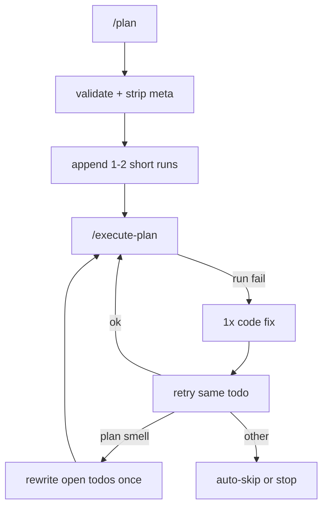
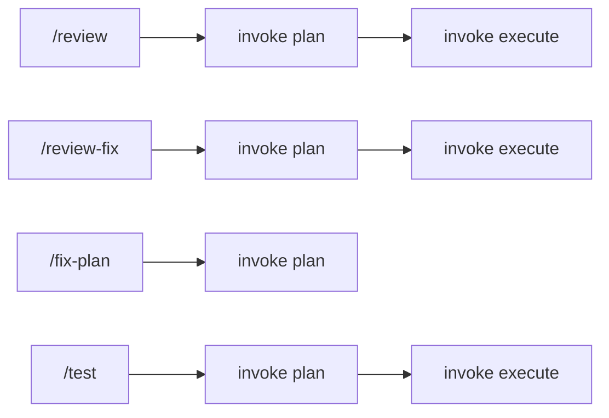

# TinyLocalCoder Architecture

File-backed LangGraph agents for **small local models** (e.g. qwen2.5:3b, `NUM_CTX≈2048`). Disk is long-term memory; the LLM usually sees **one step at a time**.

Hands-on CLI walks for common jobs: [`use-cases.md`](use-cases.md).  
LangGraph agent wiring and diagrams: [`orchestration.md`](orchestration.md).

## Constraint (non-negotiable)

Every design choice favors:

- **Few, short todos** — one tiny action each; prefer ≤8–10 total steps for a feature
- **Deterministic glue over more LLM calls** — validate / augment / classify / **replan path-fix** in Python; LLM only when it must rewrite a tiny scrap of text
- **Tools pick up the heavy lifting** — dedupe, `path/to/` strip, caps, Done narrative; never trust a 3B to manage plan structure
- **Minimal prompts** — fix/replan see failure + file *names* + open todo lines, not whole trees or big dumps
- **Short verify commands** — `py_compile` and one-line `python3 -c`; never long-running servers in todos

“More rigorous” means **harder to skip a check**, not **longer plans**.

## High-level flow

## Modes and workflows

### Core modes (single pipeline invoke)

| Mode | Role |
|------|------|
| `/plan` | Rewrite `workspace/plan.md` (Goal + numbered todos) |
| `/code` | Next create/refine todo only (or freeform show/update a file) |
| `/execute-plan` | Walk todos one-by-one (create → run/test with gated shell) |
| `/fix` | Code-only repair of last failure (no auto-replan) |
| `/ask` | Q&A → `workspace/ask.md` |

Orchestration lives in [`src/tinylocalcoder/graph/builder.py`](../src/tinylocalcoder/graph/builder.py).

### Compound workflows (plan → execute)

[`agents/workflows.py`](../src/tinylocalcoder/agents/workflows.py) chains the **existing** `/plan` then `/execute-plan` with a fixed prompt. No new LangGraph nodes or modes — the user is spared typing the two steps. The TUI streams `review » N/4` and `review-fix » N/3` so the current stage is visible.

| Workflow | Fixed plan intent | Then |
|----------|-------------------|------|
| `/review` | Tool writes `manifest.txt` first, `/plan` from that list, tool writes per-file `review.md` | `/execute-plan` |
| `/review-fix` | Parse `review.md` findings, `/plan` refine/fix todos (skip execute if none) | `/execute-plan` |
| `/fix-plan` | Compare requirement vs `plan.md` + workspace gaps, rewrite todos | *(stop — user runs `/execute-plan`)* |
| `/test` | Invent a **runnable test plan** as `plan.md` (find/run tests, or add a tiny smoke test) | `/execute-plan` |

Optional trailing text is appended to the fixed prompt (`/review focus on src/`, `/review-fix only high`, `/fix-plan start_service.sh`, `/test only unit`).

API mirrors: `POST /v1/review`, `POST /v1/review-fix`, `POST /v1/fix-plan`, `POST /v1/test`.

### Recovery and plan hygiene (during execute)

| Mechanism | Role |
|-----------|------|
| Auto-fix | One code repair + retry on a failed run todo |
| Auto-replan | One open-todo rewrite when the failing step smells like a bad plan |
| Auto-skip | Mark failed step `[!]` and continue |
| `/skip-todo N` / `/reset-todo N` | Manual skip / reopen one todo |
| `/reset-all-skipped` | Reopen every `[!]` todo |

TUI toggles: `/auto-fix`, `/auto-skip`, `/auto-replan`.

## Components

| Path | Role |
|------|------|
| `agents/thinking.py` | Plan agent (`PLAN_SYSTEM`) |
| `agents/workflows.py` | `/review` + `/review-fix` + `/fix-plan` + `/test` prompts; `run_workflow` |
| `tools/manifest.py` | Deterministic `manifest.txt` inventory for `/review` (skips archive/.index/meta) |
| `tools/review.py` | Deterministic `review.md` + parse findings for `/review-fix` |
| `memory/files.py` | Todo parse, `finalize_plan`, meta strip, validate/augment |
| `agents/coding.py` | Create/refine one file per step |
| `agents/execution.py` | Run todos + `expect …` checks |
| `agents/fixing.py` | Heuristics + LLM CREATE/WRITE; `NEEDS_REPLAN`; plan-smell classify |
| `agents/replan.py` | Tiny-context rewrite of remaining todos |
| `agents/critic.py` | End-of-pass CONTINUE/DONE (mostly deterministic by mode) |
| `tui/app.py` | Modes, workflows, meta commands |
| `config.py` | `AUTO_FIX`, `AUTO_FIX_MAX`, `AUTO_SKIP`, `AUTO_REPLAN` |

Workspace memory: `plan.md`, prototypes, `exec.log`, `ask.md`, `session.md`, `manifest.txt` / `review.md` (from `/review`; `/review-fix` reads the latter), `.index/`.

## Test-by-default plans

After `/plan`, [`finalize_plan()`](../src/tinylocalcoder/memory/files.py) always:

1. Normalizes Goal + `## Todos`
2. **Strips meta-like todos** (`reset-todo`, `skip-todo`, `review`, `review-fix`, `fix-plan`, `test`, `reset_todo_*.py`, …)
3. **Drops junk run targets** (not `python3` / `pytest` / `PYTHONPATH=…`) — e.g. bare `Define`
4. **Rewrites bad FastAPI verifies**: `from db import db; db.selectall()` → one short `from db import app; … routes …` check
5. **Caps runs**: at most one open `py_compile` and one open behavioral `-c`
6. **Augments** if still missing compile/smoke

`PLAN_SYSTEM` steers the same shape and forbids inventing a twin object named like the module.

Good archive example: [`workspace/archive/beer-api/plan.md`](../workspace/archive/beer-api/plan.md).

## Meta-command hygiene

- TUI meta commands need a leading `/`. Bare input like `reset-todo 8` is treated as meta and **not** sent to the plan agent.
- Words that are also freeform English (`plan`, `review`, `review-fix`, `test`, …) only act as commands when prefixed with `/`.
- Plan normalize / `is_meta_todo_target` drops leaked meta lines and follow-on `reset_todo_*.py` invents.

## Plan-aware recovery

Tiny-model rule: **tools do structural work**; the LLM only gets tightly framed text jobs.

On a failed run step during `/execute-plan`:

1. **Junk command** → skip immediately (no LLM fix, **does not** consume replan budget)
2. **Auto-fix once** (`AUTO_FIX_MAX=1`) — heuristics + optional CREATE/WRITE, then retry
3. If still failing and **plan smell** → **auto-replan once** (`AUTO_REPLAN=true`):
   - Collapse completed work into a one-line `Done:` narrative (not numbered `[x]` spam)
   - **Deterministic tools first**: path/import mismatch (`No module named X` + `**/X.py` exists) rewrites the open verify without an LLM
   - **LLM last resort**: return 1–2 open todo lines only; Python assembles Goal + Done + Todos
   - Discard spam / huge model output; fall back to a smoke import of an existing `.py`
4. Otherwise **auto-skip** (`[!]`), and **skip clone runs** with the same `from X import Y` prefix

`finalize_plan` always **dedupes**, strips `path/to/` placeholders, and **hard-caps** todo count so a looping 3B cannot poison `plan.md`.

Manual `/fix` does not auto-replan; it may hint to re-run execute with auto-replan on.

## Fix guardrails

- Heuristic `__init__.py` only for packages named in the failing import — not a blanket `src/`
- Fix prompt includes **one** failed todo line + workspace file name list + small snippets
- `NEEDS_REPLAN` → no file writes; graph takes the replan path

## Configuration

See [`.env.example`](../.env.example):

| Knob | Default | Meaning |
|------|---------|---------|
| `AUTO_FIX` | `true` | Repair + retry once |
| `AUTO_FIX_MAX` | `1` | Max auto-fix attempts per execute invoke |
| `AUTO_REPLAN` | `true` | One open-todo rewrite on plan smell |
| `AUTO_SKIP` | `true` | Mark failed steps `[!]` and continue |
| `NUM_CTX` | `2048` | Keep small; do not raise casually |

## Out of scope (by design)

- pytest scaffolding / TestClient-heavy verify templates as defaults
- Extra critic LLM rounds for classification
- Raising default context or multi-turn repair chats inside one step
- HTTP `/v1/fix` endpoint
