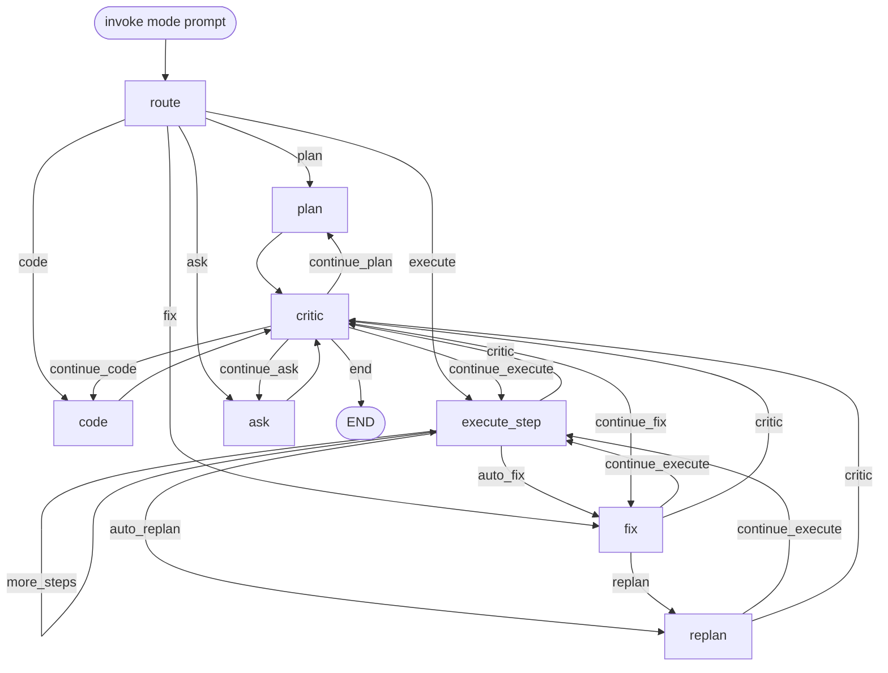
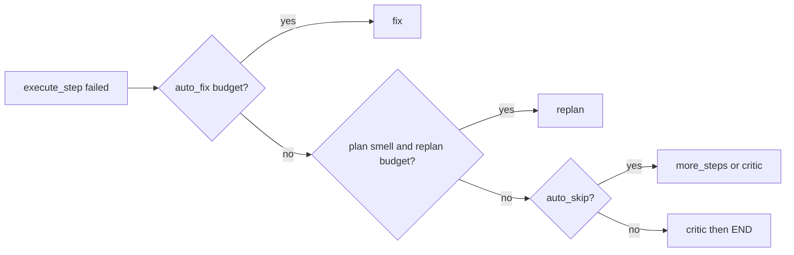

# Agent orchestration

How TinyLocalCoder wires agents through a single compiled [`StateGraph`](../src/tinylocalcoder/graph/builder.py) (`Pipeline.graph`). Entry is always `route`; `mode` on [`AgentState`](../src/tinylocalcoder/graph/state.py) selects which agent path runs. Disk (`plan.md`, prototypes, `exec.log`, …) is shared memory between nodes.

Compound CLI flows (`/review`, `/test`) are **not** graph nodes — they call `invoke("plan")` then `invoke("execute")` via [`agents/workflows.py`](../src/tinylocalcoder/agents/workflows.py). See [`Architecture.md`](Architecture.md) and [`use-cases.md`](use-cases.md).

## Agents

| Agent | Module | Graph node(s) | Role |
|-------|--------|---------------|------|
| **Plan** (thinking) | `agents/thinking.py` | `plan` | Rewrite `plan.md` as a short numbered todo list |
| **Coding** | `agents/coding.py` | `code`, also inside `execute_step` | Create/refine one file (or freeform show/update) |
| **Execution** | `agents/execution.py` | `execute_step` (run/test todos) | Gated shell run + `expect …` checks |
| **Fixing** | `agents/fixing.py` | `fix` | Repair last failure (heuristics + optional LLM write) |
| **Replan** | `agents/replan.py` | `replan` | Rewrite remaining open todos (tools first, LLM last) |
| **Ask** | `agents/ask.py` | `ask` | Q&A → `ask.md` with small context slices |
| **Critic** | `agents/critic.py` | `critic` | End-of-pass CONTINUE/DONE (often deterministic by mode) |

Supporting (not LangGraph agents): `CommandRunner` + `ApprovalGate` (shell), `WorkspaceMemory` (files/todos), workflow helpers (`review` / `test` prompts).

## Overall graph

## Node behavior (short)

| Node | What it does |
|------|----------------|
| `route` | Snapshot progress / pending files & commands; reset critic flags for this invoke |
| `plan` | `run_plan_agent` → `finalize_plan` writes `plan.md` |
| `code` | `run_coding_agent` (next create/refine, or freeform show/edit) |
| `execute_step` | One todo: coding step **or** execution step; loops via `more_steps` |
| `fix` | Junk-command skip, else `run_fix_agent`; on execute mode may retry the run todo |
| `replan` | `run_replan_agent`; forces `mode=execute` for follow-on steps |
| `ask` | `run_ask_agent` |
| `critic` | Optional; if CONTINUE, may re-enter the same mode once |

## Execute recovery edges

When `mode=execute`, failures are routed without leaving the graph:

1. **`auto_fix`** — if `AUTO_FIX` and `fix_attempts < AUTO_FIX_MAX`
2. **`auto_replan`** — if plan smell and `AUTO_REPLAN` with no prior replan this invoke
3. **Auto-skip** — mark `[!]` (and clone runs), then `more_steps` or critic
4. Else **critic** → usually **END**

## Invoke vs workflow

| Call | Graph runs |
|------|------------|
| `Pipeline.invoke("plan"\|"code"\|"execute"\|"fix"\|"ask", prompt)` | One compiled-graph pass from `route` |
| `Pipeline.invoke_workflow("review"\|"test", prompt)` | Two invokes: plan (fixed prompt) then execute |

Recursion limit is `40` per invoke (`graph.invoke(..., config={"recursion_limit": 40})`).
