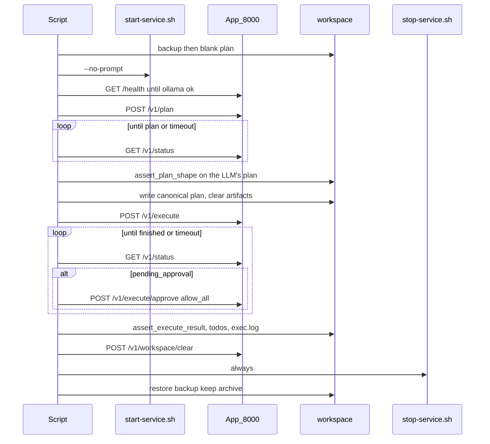

# Integration tests for plan → execute

Unattended checks of the documented `/plan` then `/execute-plan` use case
([docs/use-cases.md](../docs/use-cases.md)). They drive the HTTP API on `:8000`,
not the TUI.

| Runner | Language | Asserts |
| --- | --- | --- |
| [`run-hello-world-c.sh`](run-hello-world-c.sh) | C | `hello-world.c`, a `gcc` compile todo, an executable `hello-world` |
| [`run-hello-world-py.sh`](run-hello-world-py.sh) | Python | `greet.py`, a `py_compile` todo, `__pycache__/greet.*.pyc` |

```bash
./integration-tests/run-hello-world-c.sh
./integration-tests/run-hello-world-py.sh
```

Run them one at a time: each one owns the live `./workspace` and the compose
suite for the length of its run.

Safe to run again: each invocation stops any leftover suite, resets artifacts,
uses the same canonical plan after `/plan`, then restores `./workspace`.

Not wired into `./run-tests.sh` or GitHub unit CI (needs Docker, Ollama,
~12 GB RAM, and a long runtime).

## Shape: one harness, two sets of assertions

Everything that is not language-specific lives in
[`lib.sh`](lib.sh) — service lifecycle, workspace backup/restore, API polling,
the approval gate, the summary and the exit code. A runner sources it, sets a
few variables, defines two hooks, and calls `run_integration_test`:

| Name | Meaning |
| --- | --- |
| `TEST_NAME` | banner text |
| `PLAN_PROMPT` | the `/v1/plan` prompt |
| `CANONICAL_PLAN` | fixed `plan.md` bytes substituted before execute |
| `TEST_ARTIFACTS` | workspace-relative paths to delete before the run |
| `assert_plan_shape` | hook: is the LLM's *own* plan the right shape? |
| `assert_execute_result` | hook: does the workspace look right after execute? |

Hooks may call `log` / `pass` / `fail` / `dump_plan` / `dump_exec_log` and read
`WORKSPACE` and `PLAN_FILE`. The assertions that are the same for every
language — numbered todos exist, every todo ends `[x]` with no `[!]` skips, and
`exec.log` has no `junk run command` line — are asserted by the harness itself.

Adding a language should be one new runner of roughly 60 lines. That mirrors
the design rule in [CLAUDE.md](../CLAUDE.md): a language is a table entry in
`toolchains.py`, not a new code path.

## Purpose

Protect this path, per language:

1. Start the suite with no human input.
2. Ask for a small program in that language.
3. Expect a real plan in `workspace/plan.md` that has, of its own accord, a
   compile todo and a behavioural run todo **built from that language's
   toolchain**. Then replace it with the **canonical plan** so the execute
   stage sees the same bytes every run.
4. Execute every todo, approving each gate.
5. Expect the source file, the compile *product* (a binary, a `.pyc`), every
   todo marked `[x]`, and no "junk run command" line in `exec.log`.
6. `POST /v1/workspace/clear` (same as TUI `/clear-workspace`).
7. Stop the suite that was started.
8. Exit `0` if every check passed, else `1`.

Why each language is worth a test:

- **C** is the new path. This test used to force a create-only plan and
  actively *deny* any `gcc` gate, because the planner was Python-centric and
  could not produce a working C plan: `gcc` was not in the run-command
  allowlist, so `finalize_plan` dropped every build todo. Now that languages
  come from `toolchains.py`, the compile step is the point of the test. If the
  planner emits no build todo, or the binary is never produced, it fails.
- **Python** is the regression guard. The registry was factored *out of* a
  hardcoded Python path, so the Python plan must still come out exactly as it
  always did: create, one batched `py_compile`, one short behavioural
  `python3 -c`. It additionally asserts the negatives — no other language's
  build command leaks in, and no `apt-get` todo appears for a toolchain that
  is already installed.

## Sequence



## API: poll and `allow_all`

`POST /v1/plan` and `POST /v1/execute` start a background run and wait about
60 seconds, then may return `status: "running"`. A second `POST` returns 409.

`GET /v1/status` returns the same `RunResponse` snapshot for the last mode so
the script can keep polling.

The compile and run todos do hit the shell gate. The harness posts `POST
/v1/execute/approve` with `decision: "allow_all"` for every pending command;
earlier revisions denied anything matching `gcc|clang|compile`, which is
exactly the behaviour these tests now exist to prove unnecessary.

## Harness steps

1. **Backup `./workspace`** to a temp dir. Reset `plan.md` and remove every
   path in `TEST_ARTIFACTS` plus `exec.log` — that log is append-only, so a
   stale one would let a previous session's failures read as this run's.
   **Stop** any leftover suite so a second run does not inherit the first.
2. **Start** with `AUTO_FIX=false` and `AUTO_REPLAN=false`, then
   `./start-service.sh --no-prompt`. Wait until
   `GET http://localhost:8000/health` reports `ollama: true` (about 5 minutes
   for a first model pull).
3. **Plan:** `POST /v1/plan` with `PLAN_PROMPT` and
   `"thinking_enabled": false`. Poll `GET /v1/status` until the run is
   **finished** (`ok` / `error` / `denied` / `failed`). Do not start execute
   while status is `running` (that is a 409).
4. **Expect a plan:** fail if `plan.md` has no numbered todos, or if
   `assert_plan_shape` rejects it — the planner must reach the create →
   compile → run shape unaided. Then write the **same canonical `plan.md`**
   every run and re-clear the artifacts. Writing only after the planner thread
   exits, so it cannot overwrite the fixture.
5. **Execute:** `POST /v1/execute` walks every todo, approving each gate. Fail
   immediately on HTTP 409. Poll until execute is **finished**. Do not treat a
   non-empty file as done while status is still `running`.
6. **Expect a working program:** `assert_execute_result`, then every todo `[x]`
   with no `[!]` skips, and no `junk run command` in `exec.log`.
7. **`/clear-workspace`:** only after execute has finished. `POST
   /v1/workspace/clear` returns 409 if a run is still alive. On success it
   archives into `workspace/archive/<timestamp>` and blanks `plan.md`. Fail if
   any `TEST_ARTIFACTS` path is still in the live workspace.
8. **Shutdown** with `./stop-service.sh` from the EXIT trap (always stop what
   we started).
9. **Exit:** print a short pass/fail summary. Restore the pre-test workspace
   backup, but keep `archive/` from `/clear-workspace`. `exit 1` if any check
   failed, else `exit 0`.

Helpers are bash plus `curl` / `python3` for JSON. Failures set `FAILED=1`
and are reported at the end; the trap always runs.

## Repeatability

Each run is meant to be interchangeable:

- Stop leftover compose first; stop again on EXIT (idempotent cleanup).
- `AUTO_FIX=false` and `AUTO_REPLAN=false`, so the recovery ladder cannot
  paper over a plan that was wrong to begin with. These tests assert the
  planner and executor get it right on the first pass; the ladder itself is
  covered by the graph-level unit tests.
- After `/plan` **finishes** (not merely after `plan.md` looks valid), execute
  always sees the same canonical `plan.md`.
- `exec.log` and every `TEST_ARTIFACTS` path are removed both before the run
  and again after the canonical plan is written.
- Execute must finish before `/clear-workspace`. The API refuses clear while a
  run thread is alive (409).
- HTTP helpers record the status code so 409 is not treated as an in-flight
  snapshot.
- Every gate is approved with `allow_all` — the build commands are the point.
- End with `/clear-workspace` (`POST /v1/workspace/clear`) so test files are
  archived, not left in the live workspace.
- Workspace backup is restored on every exit so the next run starts from the
  user's files; `archive/` from `/clear-workspace` is kept.

## Isolation / safety

- Write into the live `./workspace` only during the test window; restore on EXIT.
- Do not add these runners to `.github/workflows/tests.yml`.
- Do not change `PLAN_SYSTEM` for these tests.

## Timeouts

| Phase | Timeout | Override |
| --- | --- | --- |
| Health / Ollama ready | 5 minutes | `TLC_HEALTH_TIMEOUT_SEC` |
| Plan complete | 10 minutes | `TLC_PLAN_TIMEOUT_SEC` |
| Execute complete | 20 minutes | `TLC_EXECUTE_TIMEOUT_SEC` |

The API base URL is `TLC_API` (default `http://localhost:8000`).

## Out of scope

- Other use cases (`/fix`, `/review`, `/test`).
- Wiring into `./run-tests.sh`.
- Changing Colima / compose RAM defaults.
