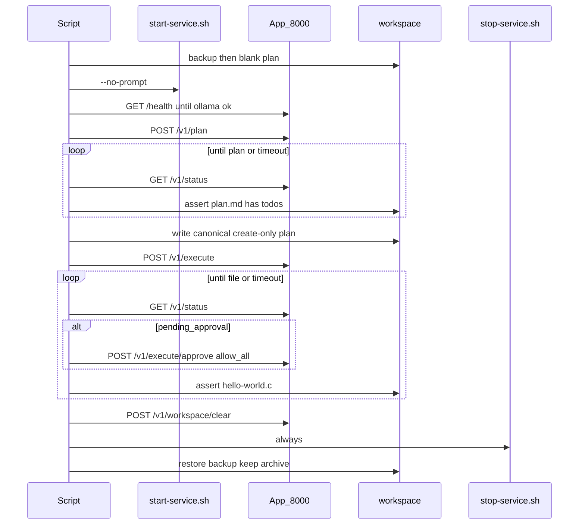

# Integration test for plan → execute (C hello world)

Unattended check of the documented `/plan` then `/execute-plan` use case
([docs/use-cases.md](../docs/use-cases.md)). Drive the HTTP API on `:8000`,
not the TUI.

Runner: [`run-hello-world-c.sh`](run-hello-world-c.sh)

```bash
./integration-tests/run-hello-world-c.sh
```

Safe to run again: each invocation stops any leftover suite, resets artifacts,
uses the same create-only plan after `/plan`, then restores `./workspace`.

Not wired into `./run-tests.sh` or GitHub unit CI (needs Docker, Ollama,
~12 GB RAM, and a long runtime).

## Purpose

Protect this path:

1. Start the suite with no human input.
2. Ask for a C file `hello-world.c` that prints hello world (**coding only**).
3. Expect a real plan in `workspace/plan.md`, then replace it with the
   **canonical create-only plan** (one `create hello-world.c` todo).
4. Execute the create todo only.
5. Expect `workspace/hello-world.c`. Do not compile or run the program.
6. `POST /v1/workspace/clear` (same as TUI `/clear-workspace`).
7. Stop the suite that was started.
8. Exit `0` if every check passed, else `1`.

`PLAN_SYSTEM` stays Python-centric on purpose. If the planner never emits
`hello-world.c`, this test should fail.

## Sequence



## API: poll and `allow_all`

`POST /v1/plan` and `POST /v1/execute` start a background run and wait about
60 seconds, then may return `status: "running"`. A second `POST` returns 409.

`GET /v1/status` returns the same `RunResponse` snapshot for the last mode so
the script can keep polling.

A create-only plan should not hit the shell gate. If status is still
`pending_approval`, the script posts `POST /v1/execute/approve` with
`decision: "allow_all"` so a leaked run todo cannot hang the test.

## Script steps

1. **Backup `./workspace`** to a temp dir. Reset `plan.md` and remove leftover
   `hello-world.c` / `hello_world.c` / binaries. **Stop** any leftover suite
   so a second run does not inherit the first.
2. **Start** with `AUTO_FIX=false` and `AUTO_REPLAN=false` (autofix was
   adding a compile/run todo) then `./start-service.sh --no-prompt`. Wait until
   `GET http://localhost:8000/health` reports `ollama: true` (about 5 minutes
   for a first model pull).
3. **Plan:** `POST /v1/plan` with a **coding-only** prompt (create
   `hello-world.c`, no compile/run) and `"thinking_enabled": false`. Poll
   `GET /v1/status` until the run is **finished** (`ok` / `error` / `denied` /
   `failed`). Do not start execute while status is `running` (that is a 409).
4. **Expect a plan:** after the plan run is done, fail if `plan.md` has no
   numbered hello-world todo. Then write the **same canonical create-only
   `plan.md`** every run (one `create hello-world.c` todo). Writing only after
   the planner thread exits so it cannot overwrite the fixture.
5. **Execute:** `POST /v1/execute` walks the create todo and writes the file.
   Fail immediately on HTTP 409. Poll until execute is **finished**, then
   assert `hello-world.c`. Do not treat a non-empty file as done while status
   is still `running`.
6. **Expect `workspace/hello-world.c`:** file exists, is non-empty, and
   contains `hello` (case-insensitive) or a `printf` / `puts`. Success is
   the source file — not a binary.
7. **`/clear-workspace`:** only after execute has finished. `POST
   /v1/workspace/clear` returns 409 if a run is still alive. On success it
   archives into `workspace/archive/<timestamp>` and blanks `plan.md`. Fail if
   `hello-world.c` is still in the live workspace.
8. **Shutdown** with `./stop-service.sh` from the EXIT trap (always stop what
   we started).
9. **Exit:** print a short pass/fail summary. Restore the pre-test workspace
   backup, but keep `archive/` from `/clear-workspace`. `exit 1` if any
   check failed, else `exit 0`.

Helpers are bash plus `curl` / `python3` for JSON. Failures set `FAILED=1`
and are reported at the end; the trap always runs.

## Repeatability

Each run is meant to be interchangeable:

- Stop leftover compose first; stop again on EXIT (idempotent cleanup).
- `AUTO_FIX=false` and `AUTO_REPLAN=false` so recovery cannot add compile todos.
- After `/plan` **finishes** (not merely after `plan.md` looks valid), execute
  always sees the same canonical `plan.md`.
- Execute must finish before `/clear-workspace`. The API refuses clear while a
  run thread is alive (409).
- HTTP helpers record the status code so 409 is not treated as an in-flight
  snapshot.
- Compile/run gates (`gcc`, `clang`, `./hello-world`) are **denied**.
- End with `/clear-workspace` (`POST /v1/workspace/clear`) so test files are
  archived, not left in the live workspace.
- Workspace backup is restored on every exit so the next run starts from the
  user's files; `archive/` from `/clear-workspace` is kept.

## Isolation / safety

- Write into the live `./workspace` only during the test window; restore on EXIT.
- Do not add this runner to `.github/workflows/tests.yml`.
- Do not change `PLAN_SYSTEM` for this test.

## Timeouts

| Phase | Timeout |
| --- | --- |
| Health / Ollama ready | 5 minutes |
| Plan complete | 10 minutes |
| Execute complete | 20 minutes |

## Out of scope

- Other use cases (`/fix`, `/review`, `/test`).
- Wiring into `./run-tests.sh`.
- Changing Colima / compose RAM defaults.
